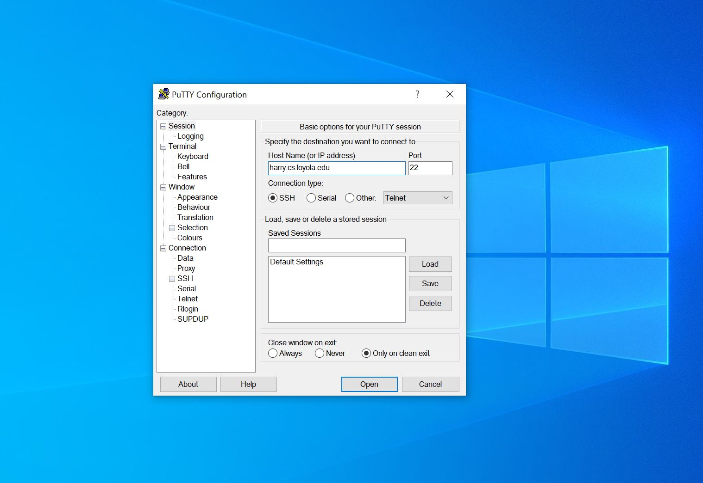
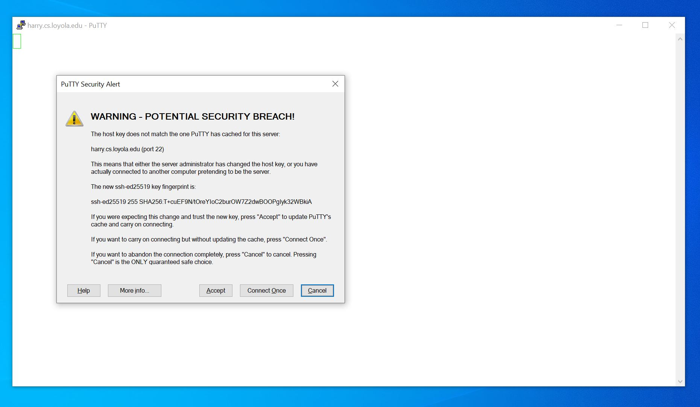
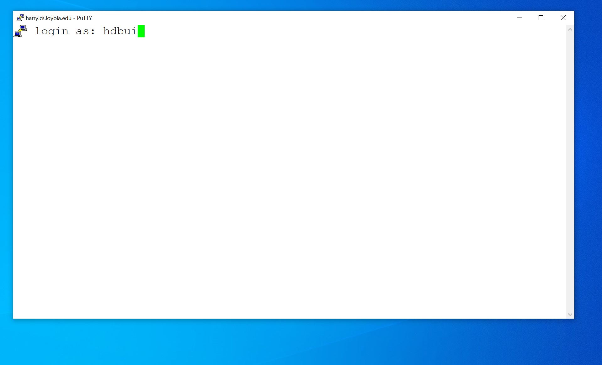
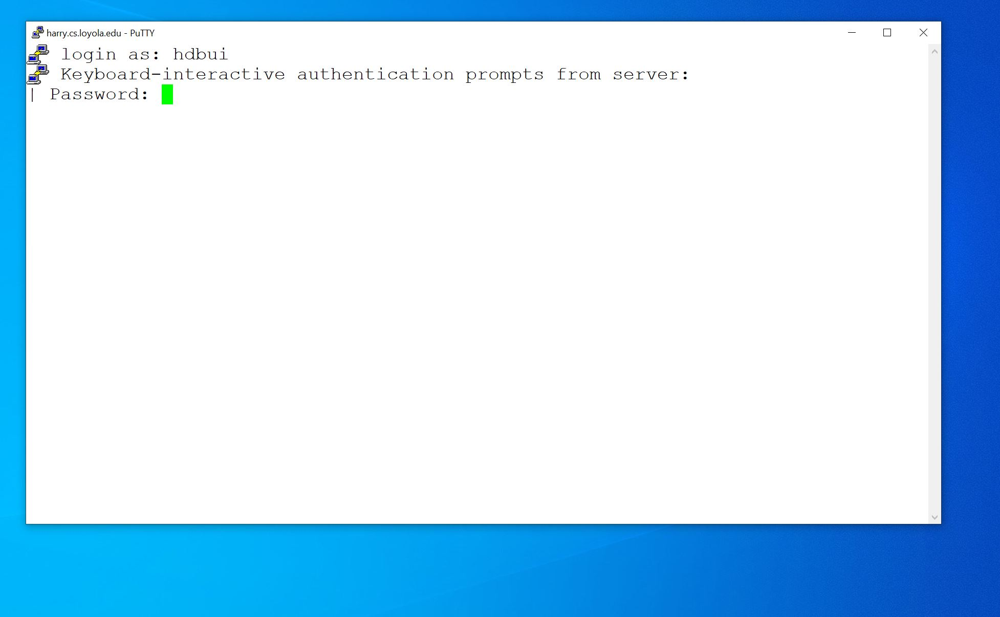
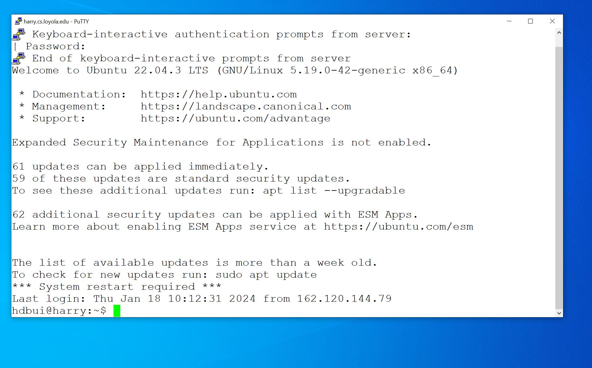

## Overview

This guide will show you how to connect to a Linux machine and introduce you to to the Linux environment (shell/terminal).
We name our Linux machines after characters and locations from the Harry Potter books and movies.  They are harry, ron, hermione, lupin, crookshanks, Bellatrix, Dumbledore, draco, snape, luna, ginny, Neville, peeves, and mcgonagall. The machines are physically located in the Linux Lab (DS 130)
You can choose to log on any of these machines to do your work.


## How to log on if you are using Windows
We will use a tool named PuTTY. There are other tools available but let's start with PuTTY. PuTTY can be downloaded [here](https://the.earth.li/~sgtatham/putty/latest/x86/putty.exe).
Once open PuTTY, enter **harry.cs.loyola.edu** under Host Name and hit **Open**



You you log on to the machine for the first time, you may see this message. Just hit **Accept**.



Type in your userid



Hit "Return/Enter" and type in your password. Please note that your password will not show as you type it in



After all, you will get to this screen.



## How to log on if you are a Macs/Linux user
Mac and Linux users can use the **terminal app** under **Utilities** to connect to any of the machines using ssh with your userid and password. In this example, I will log on to ron.cs.loyola.edu

```
 hbui@CSDS-3KQSQ6LR ~ % ssh hdbui@ron.cs.loyola.edu
The authenticity of host 'ron.cs.loyola.edu (144.126.12.129)' can't be established.
ED25519 key fingerprint is SHA256:9xOwI9Yta0o+lvDAzXdRQmof5+Wj/hmRp/aJwz0uldk.
This key is not known by any other names.
Are you sure you want to continue connecting (yes/no/[fingerprint])? yes
Warning: Permanently added 'ron.cs.loyola.edu' (ED25519) to the list of known hosts.
(hdbui@ron.cs.loyola.edu) Password: 
Welcome to Ubuntu 22.04.3 LTS (GNU/Linux 5.19.0-41-generic x86_64)

 * Documentation:  https://help.ubuntu.com
 * Management:     https://landscape.canonical.com
 * Support:        https://ubuntu.com/advantage

Expanded Security Maintenance for Applications is not enabled.

61 updates can be applied immediately.
59 of these updates are standard security updates.
To see these additional updates run: apt list --upgradable

62 additional security updates can be applied with ESM Apps.
Learn more about enabling ESM Apps service at https://ubuntu.com/esm


The list of available updates is more than a week old.
To check for new updates run: sudo apt update
*** System restart required ***
Last login: Thu Jan 18 10:11:36 2024 from 162.120.144.79
hdbui@ron:~$ 

```

## Once you log on, you can try out a few basic commands. You will probably see these commands in CS 266

### uname
Display system information

```
hdbui@ron:~$ uname
Linux
hdbui@ron:~$ uname -r
5.19.0-41-generic
```

### pwd
Show current working director

```
hdbui@ron:~$ pwd
/home/hdbui
```

### ls

List what inside a directory

```
hdbui@ron:~$ ls
1      backup	  Downloads	http	 mynote     Public     tmp
2      bash	  example.html	loop.sh  new-cs266  regex      usr
266    class	  Files		loyola	 newdir     sed        Videos
366    cs266	  filters	me3.c	 news.txt   shared     work
a.out  Desktop	  git-runner	me4.c	 newtest    Templates
awk    Documents  hello.c	Music	 Pictures   test.c
```

### cd

Navigate to a directory

```
hdbui@ron:~$ cd Files
hdbui@ron:Files$ ls
foo  foobar
```

### cd ..

Navigate back one directory

```
hdbui@ron:Files$ pwd
/home/hdbui/Files
hdbui@ron:Files$ cd ..
hdbui@ron:~$ pwd
/home/hdbui
```

### mkdir

Create a directory
```
hdbui@ron:~$ cd Files
hdbui@ron:Files$ mkdir code
hdbui@ron:Files$ ls
code  foo  foobar
```

### cd ~

Go back to your home directory

```
hdbui@ron:Files$ cd code
hdbui@ron:code$ pwd
/home/hdbui/Files/code
hdbui@ron:code$ cd ~
hdbui@ron:~$ pwd
/home/hdbui
```

### date

Date and time

```
hdbui@ron:~$ date
Thu Jan 18 10:20:05 AM EST 2024
```
### who

Show who is currently using the system

hdbui@ron:~$ who
mflll    pts/0        2023-05-19 19:07 (:1)
mflll    pts/6        2023-04-16 20:21 (:1)
mflll    pts/7        2023-05-16 19:22 (:1)
dmp120   pts/8        2023-04-26 15:28 (10.16.240.13)
cth105   pts/10       2023-04-24 11:38 (jakes-imac.ad.wiu.edu)
mflll    pts/13       2023-05-19 16:56 (:4)
hdbui    pts/0        2024-01-18 10:13 (162.120.144.79)

### who am i

Your username/userid/handle

hdbui@ron:~$ who am i
hdbui    pts/0        2024-01-18 10:13 (162.120.144.79)


## When you are done, you can just close puTTy or terminal


