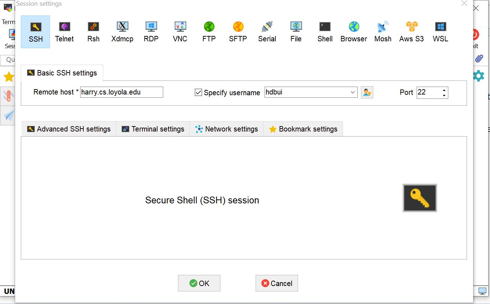
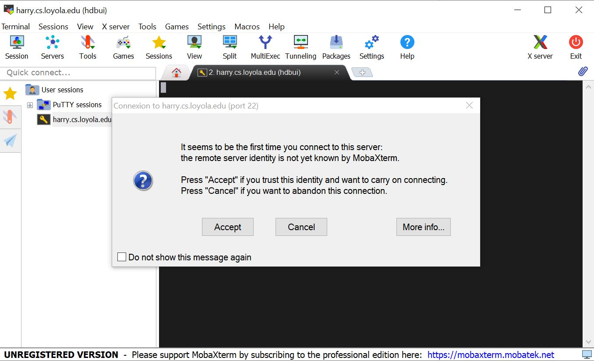
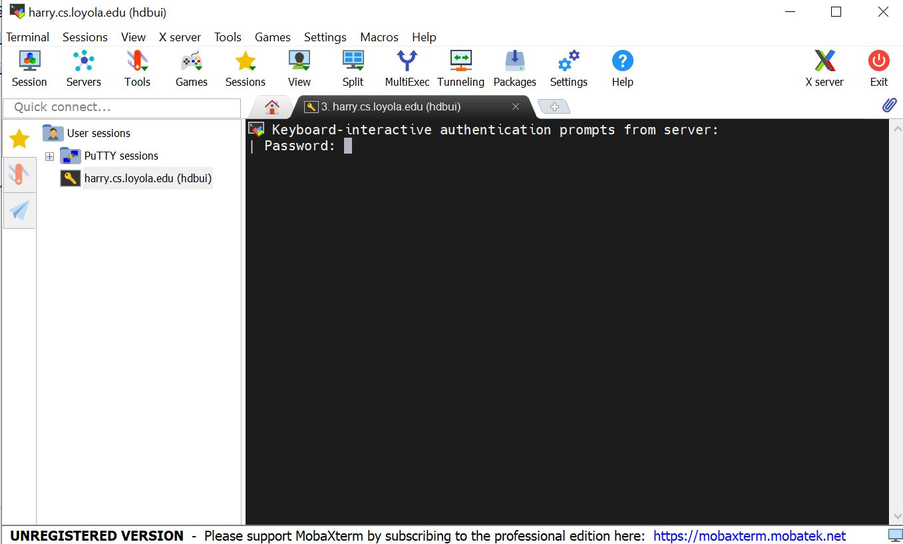
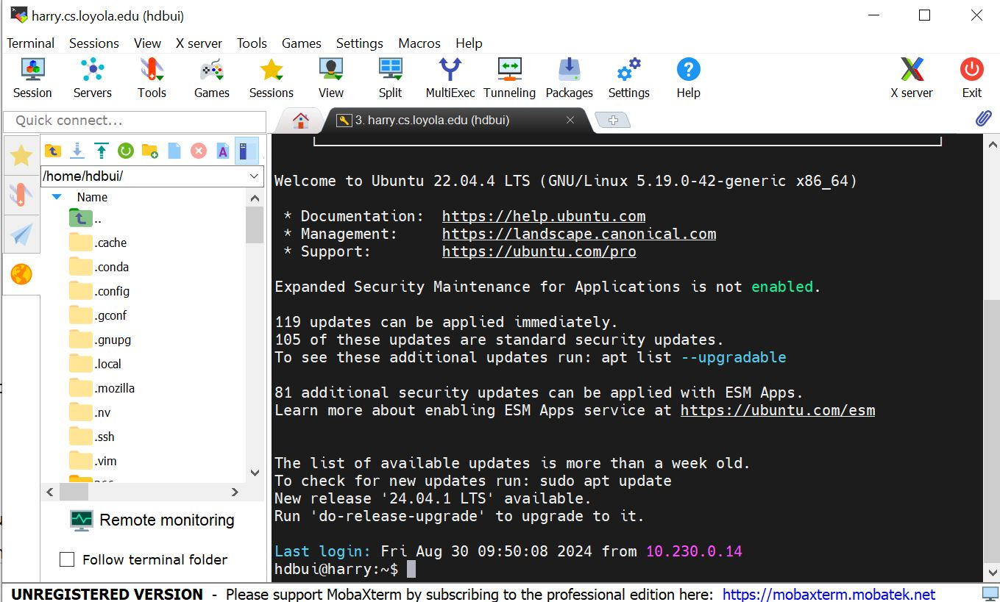

## Overview

This guide will show you how to connect to a Linux machine and introduce you to the Linux environment (shell/terminal)

List of Linux machines: (remember to add .cs.loyola.edu to complete hostname)
Anywhere: hogwarts, hogsmeade, and draco
On campus only: thorin, balin, dwalin, oin, gloin, fili, kili, ori, dori, bifur, and bofur

You can choose to log on any of these machines to do your work.


## How to log on if you are using Windows
We will use a tool named MobaXterm. There are other tools available but let's start with MobaXterm. MobaXterm (Portable edition) can be downloaded [here](https://mobaxterm.mobatek.net/download-home-edition.html).
Once you open MobaXterm, click on Session, then SSH enter **hogwarts.cs.loyola.edu** under Remote host, select Specify username, and put your loyola id in the box (For me it is hdbui), and hit **OK**



You you log on to the machine for the first time, you may see this message. Just hit **Accept**.



Type in your password. Your initial password is your ID number. You will need to change after logging in the first time. 



Hit "Return/Enter" and type in your password. Please note that your password will not show as you type it in

After all, you will get to this screen.



## How to log on if you are a Macs/Linux user
Mac and Linux users can use the **terminal app** under **Utilities** to connect to any of the machines using ssh with your userid and password. In this example, I will log on to ron.cs.loyola.edu

```
hbui@CSDS-3KQSQ6LR ~ % ssh hdbui@hogwarts.cs.loyola.edu
The authenticity of host 'hogwarts.cs.loyola.edu (144.126.12.129)' can't be established.
ED25519 key fingerprint is SHA256:9xOwI9Yta0o+lvDAzXdRQmof5+Wj/hmRp/aJwz0uldk.
This key is not known by any other names.
Are you sure you want to continue connecting (yes/no/[fingerprint])? yes
Warning: Permanently added 'hogwarts.cs.loyola.edu' (ED25519) to the list of known hosts.
(hdbui@ron.cs.loyola.edu) Password: 
Welcome to Ubuntu 22.04.3 LTS (GNU/Linux 5.19.0-41-generic x86_64)

 * Documentation:  https://help.ubuntu.com
 * Management:     https://landscape.canonical.com
 * Support:        https://ubuntu.com/advantage

Expanded Security Maintenance for Applications is not enabled.

61 updates can be applied immediately.
59 of these updates are standard security updates.
To see these additional updates run: apt list --upgradable

62 additional security updates can be applied with ESM Apps.
Learn more about enabling ESM Apps service at https://ubuntu.com/esm


The list of available updates is more than a week old.
To check for new updates run: sudo apt update
*** System restart required ***
Last login: Sun Sep 1 10:11:36 2024 from 162.120.144.79
hdbui@hogwarts:~$ 

```

## Once you log on, you can try out a few basic commands.

### uname
Display system information

```
hdbui@hogwarts:~$ uname
Linux
hdbui@hogwarts:~$ uname -r
5.19.0-41-generic
```

### pwd
Show current working director

```
hdbui@hogwarts:~$ pwd
/home/hdbui
```

### ls

List what is inside a directory

```
hdbui@ron:~$ ls
1      backup	  Downloads	http	 mynote     Public     tmp
2      bash	  example.html	loop.sh  new-cs266  regex      usr
266    class	  Files		loyola	 newdir     sed        Videos
366    cs266	  filters	me3.c	 news.txt   shared     work
a.out  Desktop	  git-runner	me4.c	 newtest    Templates
awk    Documents  hello.c	Music	 Pictures   test.c
```

### cd

Navigate to a directory

```
hdbui@hogwarts:~$ cd Files
hdbui@hogwarts:Files$ ls
foo  foobar
```

### cd ..

Navigate back one directory

```
hdbui@hogwarts:Files$ pwd
/home/hdbui/Files
hdbui@hogwarts:Files$ cd ..
hdbui@hogwarts:~$ pwd
/home/hdbui
```

### mkdir

Create a directory
```
hdbui@hogwarts:~$ cd Files
hdbui@hogwarts:Files$ mkdir code
hdbui@hogwarts:Files$ ls
code  foo  foobar
```

### cd ~

Go back to your home directory

```
hdbui@hogwarts:Files$ cd code
hdbui@hogwarts:code$ pwd
/home/hdbui/Files/code
hdbui@hogwarts:code$ cd ~
hdbui@hogwarts:~$ pwd
/home/hdbui
```

### date

Date and time

```
hdbui@hogwarts:~$ date
Mon Sep 2 10:20:05 AM EST 2024
```
### who

Show who is currently using the system

```
hdbui@hogwarts:~$ who
mflll    pts/0        2024-05-19 19:07 (:1)
mflll    pts/6        2024-04-16 20:21 (:1)
mflll    pts/7        2024-05-16 19:22 (:1)
dmp120   pts/8        2024-04-26 15:28 (10.16.240.13)
cth105   pts/10       2024-04-24 11:38 (jakes-imac.ad.wiu.edu)
mflll    pts/13       2024-05-19 16:56 (:4)
hdbui    pts/0        2024-01-18 10:13 (162.120.144.79)
```
### who am i

Your username/userid/handle

```
hdbui@hogwarts:~$ who am i
hdbui    pts/0        2024-09-2 10:13 (162.120.144.79)
```

## When you are done, you can just close MobaXterm or terminal


